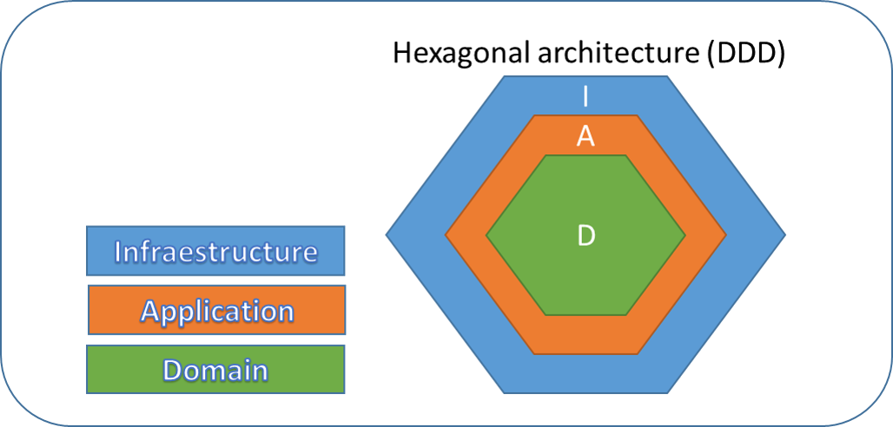

  

  

<h1 align="center">Documentación Prueba técnica</h1> 

Este proyecto contiene la estructura necesaria para construir un proyecto con net7 de tipo Domain Centric (Hex, Clean, Onion).

Los principales patrones y estilos de arquitectura que guían este microservicio son:

## Arquitectura de Puertos y Adaptadores
La idea de Puertos y Adaptadores es que la aplicación(Dominio) sea el centro del sistema. Todas las entradas y salidas alcanzan o dejan el dominio a traves de un puerto. Este puerto aisla el dominio de las tecnologias externas, herramientas y mecánicas de entrega.

El dominio mismo nunca deberia tener ningún conocimiento de quien envía o recibe la entrada y salida. Esto le permite al sistema estar asegurado contra la evolución de la tecnología y los requerimientos del negocio.

Más información [aquí](https://www.thinktocode.com/2018/07/19/ports-and-adapters-architecture/)

## CQRS (Commmand Query Responsability Segregation):
Patrón con el cual dividimos nuestro modelo de objetos en dos, un modelo para consulta(Query) y un modelo para comando(Command). Este patrón es recomendado cuando se va desarrollar lógica de negocio compleja porque nos ayuda a separar las responsabilidades y a mantener un modelo de negocio consistente.

* Consulta: modelo a través del cual se divide la responsabilidad para presentar datos en la interfaz de usuario, los objetos se modelan basado en lo que se va a presentar y no en la lógica de negocio, ejm: ver facturas, consultar clientes. Para las consultas en esta plantilla usamos Dapper.
* Comando: son todas las operaciones que cambian el estado del sistema, ejm: (facturar, aplicar descuento), este modelo se construye todo el modelo de objetos basado en la lógica de negocio de la aplicación. Las operaciones de cambio de estado del sistema las hacemos a traves de EntityFrameworkCore.

Más información [aquí](https://docs.microsoft.com/en-us/azure/architecture/patterns/cqrs)

## Especificaciones técnicas:
* Plantilla de microservicios con Net7 (Top level statements, minimal apis, mapgroup - for endpoints,  global usings, records, more...)
* Listo para contenerizar con Docker
* Entity Framework Core 7(MSSql: database + schema) Code First 
* FluentValidation
* Dapper 
* Repositorio Genérico (muy útil con el manejo de agregados) y extendido (usado para ocultar caracteristicas no necesarias del generico)
* Shadow Properties en entidades : Propiedades de que se añaden a las entidades de dominio sin "envenenar" la definicion propia de la entidad en esa capa
* Inyeccion automática de Domain Services usando anotacion "[DomainService]" y de repositorios "[Repository]"
* MediaTR : registra manejadores de commands y queries de forma automática (via reflexion hace scan del assembly)
* Manejador de Excepciones Global
* Pruebas Unitarias (Domain) con Xunit
* NSubstitute para Mocking
* Pruebas de Integración (Api) con XUnit
* Swagger

### Estructura del proyecto:
Solucion para VisualStudio(.sln) compuesta de los siguientes carpetas :

* Api : Api Rest, punto de entrada de la aplicación
* Api.Tests : Integration Tests para la Api Rest
* Application : Capa de orquestacion de servicios de dominio; Ports, Commands, Queries, Handlers
* Infrastructure : Adapters
* Domain : Entities, Value Objects, Ports, Domain Services, Aggregates
* Domain.Tests : Unit Tests para Domain Services

Estructura del proyecto

Este template contiene migraciones que debe ejecutar en caso de generar entidades partiendo de modelado con Code First, 
actualice el appsettings.json del proyecto api con la cadena de conexión a su server.

Migraciones

creación:
dotnet ef migrations add [nombre-migracion] --project .\BrowserTravel.Solutions.Infrastructure -s .\BrowserTravel.Solutions.Api -o Migrations

aplicar:
dotnet ef database update [nombre-migracion] --project .\BrowserTravel.Solutions.Api

### Nota:
El repositorio incluye una folder con colección de Postman para realizar las peticiones.

 

Cualquier duda o aporte con este proyecto contactar a anfegov@hotmail.com 